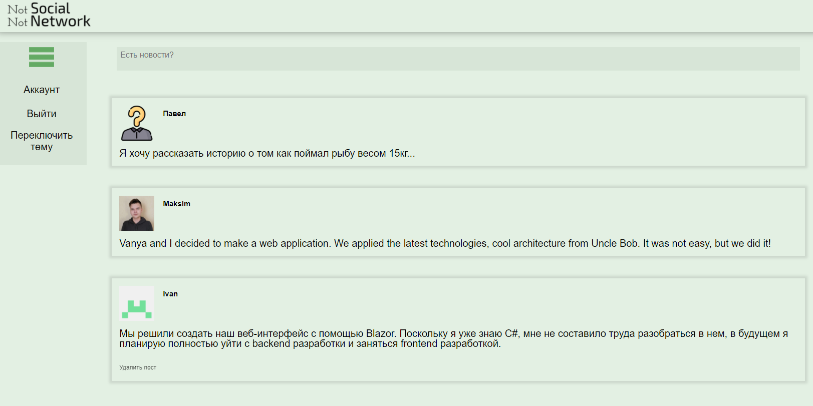
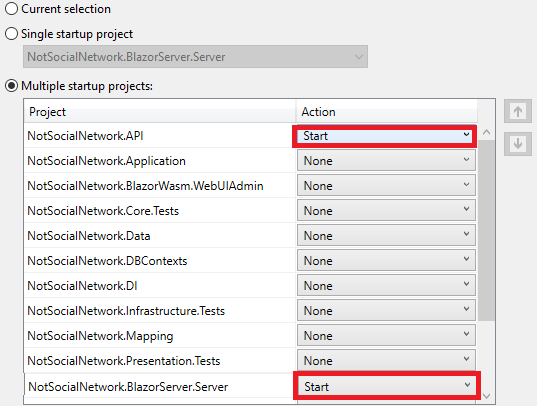
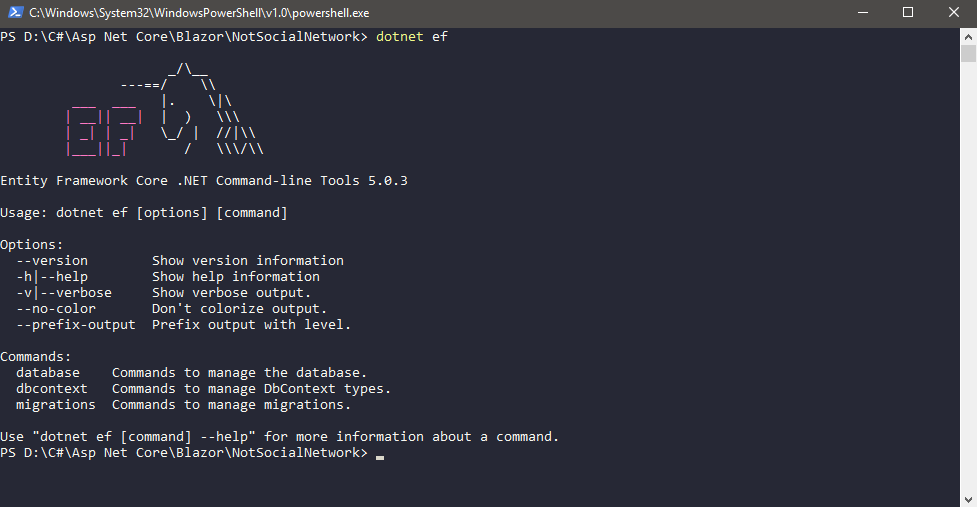

<div align="center">


</div>



> NotSocialNetwork - This is the place where people can publish their interesting posts.

## Table of contents
* [Architecture](#architecture)
* [Technologies](#technologies)
* [Versions](#versions)
* [How to start](#how-to-start)
* [How to work with project](#how-to-work-with-project)
* [Team](#team)
* [Status](#status)
* [Contacts](#contacts)

## Architecture

<a href="https://docs.microsoft.com/en-us/dotnet/architecture/modern-web-apps-azure/common-web-application-architectures" >
 
</a>
<a href="https://blog.cleancoder.com/uncle-bob/2012/08/13/the-clean-architecture.html">
 
</a>

> We tried to apply a new architecture - "Clean Architecture"

> You can read about architecture by clicking on the images.

## Technologies

<div style="text-align:left;">

<div style="float:right;">

Frontend:
* Blazor Server - v5.0
* Blazor WebAssembly - v5.0
* Html - v5.0
* Css - v3.0
* Scss
* Blazored - LocalStorage

</div>

Backend:
* C# - v9.0
* .Net - v5.0
* EntityFrameworkCore - v5.0
* Web API - v5.0
* Swagger - v5.6.3
* xUnit - v2.4.1
* Moq - v4.16.1
* JWT - v6.10.1
* Docker

</div>


## Versions

* v1.0.0
* v1.1.0
* v1.1.1

## How to start


<details>
    <summary>Docker.</summary>

### Create certificate:
* Create certificate (Edit "YourPassword" to your password)
```
dotnet dev-certs https -ep $env:USERPROFILE\.aspnet\https\NotSocialNetwork.API.pfx -p YourPassword
```
* Set your certificate in secrets
```
dotnet user-secrets set "Kestrel:Certificates:Development:Password" "YourPassword" -p Src/Presentation/NotSocialNetwork.API/
```

### Run docker:
```
docker-compose build
docker-compose up
```

| Application 	    | URL |
|------------------ | -------------------------------------- |
| NotSocialNetwork.API  | https://localhost:5001/swagger/index.html |
| NotSocialNetwork.API  | http://localhost:5000/swagger/index.html |
| Ms Sql Server  | Server=localhost;User Id=SA;Password=<YourStrong!Passw0rddD> Database=NotSocialNetworkDB; |

</details>

<details>
    <summary>Visual studio.</summary>

* In the main root of the project open properties
* Choose Multiple startup projects
* Choose NotSocialNetwork.API (start) and NotSocialNetwork.BlazorServer.Server (start), as shown in the screenshot:

* Start project

</details>

<details>
    <summary>Terminal.</summary>

### 1 Install .net 5 https://dotnet.microsoft.com/download/dotnet/5.0
### 2 Create certificate (Edit "YourPassword" to your password)

```
dotnet dev-certs https --clean
dotnet dev-certs https -ep $env:USERPROFILE\.aspnet\https\NotSocialNetwork.API.pfx -p YourPassword
dotnet dev-certs https --trust
```

### 3 Edit path in Src\Presentation\NotSocialNetwork.WebShared\Helpers\HttpHelper

``` CS
public class HttpHelper
{
    internal const string API_ADDRESS = "https://localhost:5001/api/";
```

### 4 Run projects

NotSocialNetwork.API
```
dotnet run -p .\Src\Presentation\NotSocialNetwork.API\NotSocialNetwork.API.csproj
```
NotSocialNetwork.BlazorServer.Server
```
dotnet run -p .\Src\Presentation\NotSocialNetwork.BlazorServer.Server\NotSocialNetwork.BlazorServer.Server.csproj
```

| Application 	    | URL |
|------------------ | -------------------------------------- |
| NotSocialNetwork.API  | https://localhost:5001/swagger/index.html |
| NotSocialNetwork.BlazorWasm.WebUI  | https://localhost:3001/BlazorClient |
| NotSocialNetwork.BlazorWasm.WebUIAdmin  | https://localhost:3001/Admin |

</details>

<details>
    <summary>Database connection.</summary>
    
You can run the project without a database, as we initially use InMemoryDatabase, but if you need a database, follow the instructions:
* Src / Presentation / NotSocialNetwork.API / Startup.cs change in the ConfigureServices method:

For VS or dotnet commands:
``` csharp
// In-memory database.
//ConfigureInMemoryDatabase(services);
// Real database.
ConfigureProductionServices(services);
// Real database for docker.
//ConfigureProductionServicesForDocker(services);
```
For docker:
``` csharp
// In-memory database.
//ConfigureInMemoryDatabase(services);
// Real database.
//ConfigureProductionServices(services);
// Real database for docker.
ConfigureProductionServicesForDocker(services);
```

* Src / Presentation / NotSocialNetwork.API / Program.cs change in the Main method:
``` csharp
var host = CreateHostBuilder(args).Build();

using (var scope = host.Services.CreateScope())
{
    var services = scope.ServiceProvider;
    var appDbContext = services.GetRequiredService<AppDbContext>();
    DefaultImagesInit.AddTestImage(appDbContext);
    DefaultUsersInit.AddAdmin(appDbContext);
}

#region Memory data (Hide if using real database)
//using (var scope = host.Services.CreateScope())
//{
//    var services = scope.ServiceProvider;
//    var appDbContext = services.GetRequiredService<AppDbContext>();
//    TestDataInit.AddTestData(appDbContext);
//}
#endregion

host.Run();
```
* In the main root of the project, open a console (cmd or other)
* Check that you have everything by entering as in the screenshot:
```
dotnet ef
```


> if something went wrong, read https://docs.microsoft.com/en-us/ef/core/cli/dotnet and return to the previous point

* enter:
```
dotnet ef database update -p .\Src\Infrastructure\NotSocialNetwork.DBContexts\ -s .\Src\Presentation\NotSocialNetwork.API\
```

* Start project

</details>

## How to work with project

<details>
    <summary>How to add new project.</summary>

> For example we can add new Framework in project

```
dotnet new projectType -o Src/Infrastructure/NotSocialNetwork.YourProjectName
```

```
dotnet sln add Src/Infrastructure/NotSocialNetwork.YourProjectName
```

</details>

<details>
    <summary>How to add new blazor UI.</summary>

> For example we can add new Identity project

### 1 Add new project by instruction "How to add new project"
### 2 Add new method in Src/Presentation/NotSocialNetwork.BlazorServer.Server/Startup.cs

``` csharp
private void ConnectIdentityApp(IApplicationBuilder app)
{
    app.MapWhen(ctx => ctx.Request.Path.StartsWithSegments("/Identity"), identity =>
    {
        identity.UseBlazorFrameworkFiles("/Identity");
        identity.UseStaticFiles();

        identity.UseRouting();
        identity.UseEndpoints(endpoints =>
        {
            endpoints.MapControllers();
            endpoints.MapFallbackToFile("Identity/{*path:nonfile}", "Identity/index.html");
        });
    });
}

```

### 3 Connect in Configure method
### 4 Add name in csproj
``` xml
<Project Sdk="Microsoft.NET.Sdk.BlazorWebAssembly">

  <PropertyGroup>
    <TargetFramework>net5.0</TargetFramework>
    <StaticWebAssetBasePath>Identity</StaticWebAssetBasePath> <!-->Here<!-->
  </PropertyGroup>
```
### 5 Add base in index.html
``` html
<base href="/Identity/" />
```

> Now you can call project by https://localhost:----/Identity

</details>

## Team
 | [](https://github.com/KurnakovMaksim)
--- | --- |
[Ulyanov-programmer](https://github.com/Ulyanov-programmer) | [KurnakovMaksim](https://github.com/KurnakovMaksim)

## Status
We are actively developing this project. We still have many tasks and bugs that we solve together!

## Contacts
You can write to us if you have any questions or ideas:
* ccoldatheinrich@yandex.ru - frontend
* maxmamamama2003@gmail.com - backend